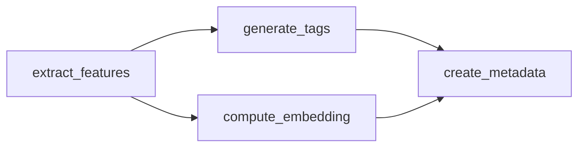

# Example: dag_visualization_demo.py

**NetworkX DAG analysis: critical path, parallel groups, exports**

> **Version**: {VERSION} | **File**: `examples/dag_visualization_demo.py`

---

## Overview

This example showcases the advanced DAG visualization and analysis capabilities introduced in Taskiq-Flow v0.4.5 using NetworkX. It demonstrates:

- Building a DAG from a DataflowPipeline
- NetworkX-based analysis (critical path detection, parallel group identification)
- Exporting to multiple formats: JSON, Mermaid, DOT, Cytoscape
- ASCII art visualization for terminal
- Integration with NiceGUI for interactive viewing

---

## What This Example Shows

- Using `DAGVisualizer` for rich DAG analysis
- Detecting the critical path (longest execution chain)
- Finding parallelizable task groups (execution levels)
- Generating Mermaid diagrams for documentation
- Exporting DOT format for Graphviz rendering
- Creating Cytoscape JSON for web-based interactive visualization

---

## Code Walkthrough

### Pipeline Definition

```python
from taskiq import InMemoryBroker
from taskiq_flow import DataflowPipeline, pipeline_task

broker = InMemoryBroker(await_inplace=True)

@broker.task
@pipeline_task(output="audio_features")
def extract_features(audio_path: str) -> dict:
    return {"duration": 180.0, "tempo": 120.0, "sample_rate": 44100}

@broker.task
@pipeline_task(output="tags")
def generate_tags(audio_features: dict) -> list[str]:
    return ["electronic", "dance", "upbeat"]

@broker.task
@pipeline_task(output="embedding")
def compute_embedding(audio_features: dict) -> list[float]:
    return [0.1, 0.2, 0.3, 0.4, 0.5]

@broker.task
@pipeline_task(output="metadata")
def create_metadata(audio_features: dict, tags: list[str], embedding: list[float]) -> dict:
    return {
        "features": audio_features,
        "tags": tags,
        "embedding": embedding,
    }

pipeline = DataflowPipeline.from_tasks(
    broker,
    [extract_features, generate_tags, compute_embedding, create_metadata]
)
pipeline.pipeline_id = "audio_analysis_demo"
```

The DAG structure:
- `extract_features` runs first (no dependencies)
- `generate_tags` and `compute_embedding` run in parallel (both depend only on `audio_features`)
- `create_metadata` runs last (depends on all three previous outputs)

---

### NetworkX Analysis with DAGVisualizer

```python
from taskiq_flow.visualization.dag_visualizer import DAGVisualizer

# Build DAG (static, without execution)
dag = pipeline.build_dag()
visualizer = DAGVisualizer(dag)

# 1. Basic JSON export
json_data = visualizer.to_json()
print(f"Nodes: {len(json_data['nodes'])}")
print(f"Edges: {len(json_data['edges'])}")
print(f"Is DAG: {not json_data['is_cyclic']}")
print(f"Topological order: {json_data['topological_order'][:3]}...")

# 2. Critical path detection
critical_path = visualizer.detect_critical_path()
print(f"Critical path: {' -> '.join(critical_path)}")

# 3. Parallel groups identification
parallel_groups = visualizer.find_parallelizable_groups()
print(f"Parallel groups: {len(parallel_groups)} levels")
for i, group in enumerate(parallel_groups):
    print(f"  Level {i}: {group}")
```

**Critical path**: Longest path through the DAG, indicating minimum execution time assuming unlimited parallelism.

**Parallel groups**: Tasks at the same level can execute concurrently.

---

### Mermaid Diagrams

```python
from taskiq_flow.visualization.mermaid import MermaidGenerator

mermaid_gen = MermaidGenerator(dag)
mermaid_code = mermaid_gen.to_mermaid_with_styling(orientation="LR")
print(mermaid_code)
```

Outputs Mermaid.js code:



Useful for embedding in docs, NiceGUI dashboards, or wikis.

---

### ASCII Art (Terminal)

```python
ascii_art = visualizer.visualize_ascii()
print(ascii_art)
```

Output example:

```
extract_features
    |
    +--> generate_tags
    |
    +--> compute_embedding
            |
            +--> create_metadata
```

Quick visual debugging without external tools.

---

### Graphviz DOT Export

```python
dot = visualizer.to_graphviz()
print(dot)
```

Save to file and render:

```bash
echo "$dot" > pipeline.dot
dot -Tpng pipeline.dot -o pipeline.png
```

Professional vector graphics for presentations.

---

### Cytoscape JSON for Web UIs

```python
cytoscape = visualizer.to_cytoscape_json()
# Contains nodes[] and edges[] arrays ready for Cytoscape.js
```

Integrate with interactive web-based DAG viewers.

---

## Expected Output

Running `python examples/dag_visualization_demo.py` produces:

```
=== Taskiq-Flow DAG Visualization Demo ===

DAG has 4 nodes and 4 edges

1. NetworkX DAG Analysis
----------------------------------------
   Nodes: 4
   Edges: 4
   Is DAG: True
   Topological order: ['extract_features', 'generate_tags', 'compute_embedding', 'create_metadata']...
   Critical path: extract_features -> generate_tags -> create_metadata
   Parallel groups: 3 levels
     Level 0: ['extract_features']
     Level 1: ['generate_tags', 'compute_embedding']
     Level 2: ['create_metadata']

2. Mermaid Diagram
----------------------------------------
flowchart LR
    extract_features --> generate_tags
    extract_features --> compute_embedding
    generate_tags --> create_metadata
    compute_embedding --> create_metadata

3. ASCII Art
----------------------------------------
extract_features
    |
    +--> generate_tags
    |
    +--> compute_embedding
            |
            +--> create_metadata

4. Graphviz DOT
----------------------------------------
digraph "audio_analysis_demo" {
  "extract_features" -> "generate_tags";
  "extract_features" -> "compute_embedding";
  "generate_tags" -> "create_metadata";
  "compute_embedding" -> "create_metadata";
}
...

5. Cytoscape JSON (for web visualization)
----------------------------------------
   Elements: 4 nodes, 4 edges

=== Demo Complete ===

All visualization formats generated successfully!
```

---

## Key Points

### DAGVisualizer Methods

| Method | Returns | Use case |
|--------|---------|----------|
| `to_json()` | dict | API responses, web UIs |
| `detect_critical_path()` | list[str] | Identify bottleneck tasks |
| `find_parallelizable_groups()` | list[list[str]] | Optimize parallelism |
| `to_graphviz()` | str | Graphviz rendering |
| `to_cytoscape_json()` | dict | Interactive web viz |
| `visualize_ascii()` | str | Terminal debugging |

### MermaidGenerator Methods

| Method | Description |
|--------|-------------|
| `to_mermaid(orientation)` | Basic flowchart |
| `to_mermaid_with_styling(orientation)` | Colored nodes by type |
| `to_mermaid_interactive()` | With click handlers |

### Integration with NiceGUI

```python
from taskiq_flow.integration.nicegui import DAGViewer

viewer = DAGViewer(dag)
viewer.render_interactive()  # Split-panel UI
# or
viewer.render_mermaid()  # Mermaid-based view
```

---

## Learning Path

After this example:

1. **[Visualization Guide]({{ '/en/guides/pipelines/#pipeline-visualization' | relative_url }})** — Full DAG visualization features
2. **[Performance Guide]({{ '/en/guides/performance/' | relative_url }})** — Using DAG analysis for optimization
3. **[NiceGUI Integration]({{ '/en/guides/pipelines/#nicegui-interactive-viewer' | relative_url }})** — Building interactive dashboards

---

*This example covers all major visualization outputs. Use `DAGVisualizer` for programmatic analysis and `MermaidGenerator` for documentation.*
