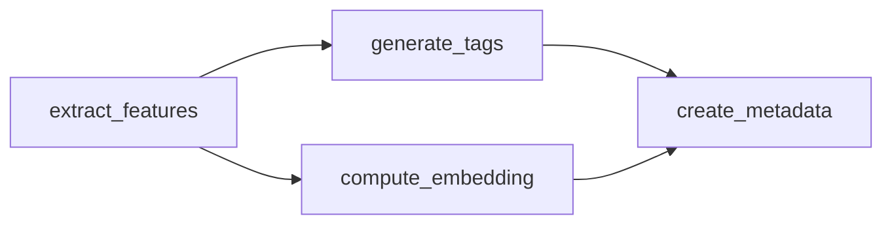

# Example: dag_visualization_demo.py

**DAG NetworkX Analysis: Critical Path, Parallel Groups, Export**

> **Version**: {VERSION} | **File**: `examples/dag_visualization_demo.py`

---

## Overview

This demo showcases advanced DAG visualization and analysis capabilities
introduced in Taskiq-Flow v0.4.5 with NetworkX, Mermaid diagramming,
and multiple export formats.

- Build a DAG from a DataflowPipeline
- NetworkX-based analysis (critical path, parallel groups)
- Export to JSON, Mermaid, DOT, Cytoscape
- Terminal ASCII visualization
- NiceGUI integration for interactive view

---

## What This Example Shows

- Using `DAGVisualizer` for rich DAG analysis
- Critical path detection (longest execution chain)
- Parallel task group identification (execution levels)
- Mermaid diagram generation for documentation
- DOT export for Graphviz rendering
- Cytoscape JSON for interactive web visualization

---

## Code Walkthrough

### 1. Pipeline Definition

```python
from taskiq import InMemoryBroker
from taskiq_flow import DataflowPipeline, pipeline_task

broker = InMemoryBroker(await_inplace=True)

@broker.task
@pipeline_task(output="audio_features")
def extract_features(audio_path: str) -> dict:
    return {"duration": 180.0, "tempo": 120.0, "sample_rate": 44100}

@broker.task
@pipeline_task(output="tags")
def generate_tags(audio_features: dict) -> list[str]:
    return ["electronic", "dance", "upbeat"]

@broker.task
@pipeline_task(output="embedding")
def compute_embedding(audio_features: dict) -> list[float]:
    return [0.1, 0.2, 0.3, 0.4, 0.5]

@broker.task
@pipeline_task(output="metadata")
def create_metadata(audio_features: dict, tags: list[str], embedding: list[float]) -> dict:
    return {
        "features": audio_features,
        "tags": tags,
        "embedding": embedding,
    }

pipeline = DataflowPipeline.from_tasks(
    broker,
    [extract_features, generate_tags, compute_embedding, create_metadata]
)
pipeline.pipeline_id = "audio_analysis_demo"
```

DAG structure:
- `extract_features` runs first (no dependencies)
- `generate_tags` and `compute_embedding` run in parallel (both depend on `audio_features`)
- `create_metadata` runs last (depends on all three predecessors)

---

### 2. NetworkX Analysis with DAGVisualizer

```python
from taskiq_flow.visualization.dag_visualizer import DAGVisualizer

dag = pipeline.build_dag()
visualizer = DAGVisualizer(dag)

# JSON export
json_data = visualizer.to_json()
print(f"Nodes: {len(json_data['nodes'])}")
print(f"Edges: {len(json_data['edges'])}")

# Critical path
critical_path = visualizer.detect_critical_path()
print(f"Critical path: {' -> '.join(critical_path)}")

# Parallel groups
parallel_groups = visualizer.find_parallelizable_groups()
print(f"Parallel groups: {len(parallel_groups)} levels")
for i, group in enumerate(parallel_groups):
    print(f"  Level {i}: {group}")
```

**Critical Path**: Longest path in the DAG — minimum execution time with unlimited parallelism.

**Parallel Groups**: Tasks on the same level can run concurrently.

---

### 3. Mermaid Diagrams

```python
from taskiq_flow.visualization.mermaid import MermaidGenerator

mermaid_gen = MermaidGenerator(dag)
mermaid_code = mermaid_gen.to_mermaid_with_styling(orientation="LR")
print(mermaid_code)
```

Output:


```mermaid
flowchart LR
    A[extract_features] --> B[generate_tags]
    A --> C[compute_embedding]
    B --> D[create_metadata]
    C --> D
```

---

### 4. ASCII Art (Terminal)

```python
ascii_art = visualizer.visualize_ascii()
print(ascii_art)
```

Output:
```
extract_features
    |
    +--> generate_tags
    |
    +--> compute_embedding
            |
            +--> create_metadata
```

---

### 5. Graphviz DOT Export

```python
dot = visualizer.to_graphviz()
# Save and render: dot -Tpng pipeline.dot -o pipeline.png
```

---

### 6. Cytoscape JSON (Web)

```python
cytoscape = visualizer.to_cytoscape_json()
# Contains nodes[] and edges[] ready for Cytoscape.js
```

---

## Expected Output

```
=== Taskiq-Flow DAG Visualization Demo ===

DAG has 4 nodes and 4 edges

1. NetworkX DAG Analysis
----------------------------------------
   Nodes: 4
   Edges: 4
   Critical path: extract_features -> generate_tags -> create_metadata
   Parallel groups: 3 levels
     Level 0: ['extract_features']
     Level 1: ['generate_tags', 'compute_embedding']
     Level 2: ['create_metadata']

2. Mermaid Diagram
----------------------------------------
flowchart LR
    extract_features --> generate_tags
    ...

3. ASCII Art
----------------------------------------
extract_features
    |
    +--> generate_tags
    ...

4. Graphviz DOT
----------------------------------------
digraph "audio_analysis_demo" {
  "extract_features" -> "generate_tags";
  ...
}

5. Cytoscape JSON
----------------------------------------
   Elements: 4 nodes, 4 edges

=== Demo Complete ===
```

---

## Key Points

### DAGVisualizer Methods

| Method | Returns | Use Case |
|--------|---------|----------|
| `to_json()` | dict | API responses, web UIs |
| `detect_critical_path()` | list[str] | Find bottleneck tasks |
| `find_parallelizable_groups()` | list[list[str]] | Optimize parallelism |
| `to_graphviz()` | str | Graphviz rendering |
| `to_cytoscape_json()` | dict | Interactive web viz |
| `visualize_ascii()` | str | Terminal debugging |

### MermaidGenerator Methods

| Method | Description |
|--------|-------------|
| `to_mermaid(orientation)` | Basic flowchart |
| `to_mermaid_with_styling(orientation)` | Colored nodes by type |
| `to_mermaid_interactive()` | With click handlers |

### NiceGUI Integration

```python
from taskiq_flow.visualization.mermaid import MermaidGenerator

mermaid_gen = MermaidGenerator(dag)
mermaid_code = mermaid_gen.to_mermaid_with_styling()
# Embed in a NiceGUI page:
#   ui.markdown(f"```mermaid\n{mermaid_code}\n```")
```

`MermaidGenerator` produces Mermaid.js source; NiceGUI `ui.markdown()` renders it in the browser.

---

## Learning Path

After this example:

1. **[Visualization Guide]({{ '/en/guides/pipelines/#pipeline-visualization' | relative_url }})** — Full DAG visualization features
2. **[Performance Guide]({{ '/en/guides/performance/' | relative_url }})** — Use DAG analysis for optimization
3. **[NiceGUI Integration]({{ '/en/guides/pipelines/#nicegui-interactive-viewer' | relative_url }})** — Build interactive dashboards

---

*This example covers all major visualization output formats. Use `DAGVisualizer` for programmatic analysis and `MermaidGenerator` for documentation.*
