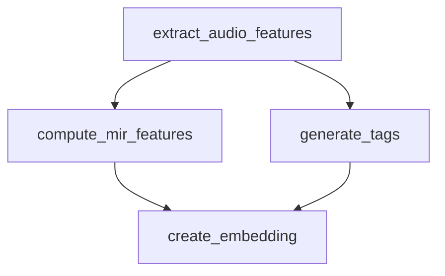

# Example: dataflow_audio_pipeline.py

**Complete dataflow DAG with parallel execution, map-reduce, and visualization**

> **Version**: {VERSION} | **File**: `examples/dataflow_audio_pipeline.py`

---

## Overview

This comprehensive example showcases the full power of DataflowPipeline with:

- Automatic DAG construction from task dependencies
- Parallel execution of independent tasks
- Map-reduce pattern for batch processing
- Pipeline visualization (DOT, JSON, ASCII)
- Mixed sequential and parallel workflows

This is the reference example for understanding dataflow architecture.

---

## What This Example Shows

- **`@pipeline_task`** decorator usage with single and multiple outputs
- **Automatic dependency resolution** — tasks declare outputs; downstream tasks consume by parameter name
- **Parallel execution** — tasks with same dependency run concurrently
- **Map-reduce pattern** — batch processing with `.map()` and `.reduce()`
- **DAG visualization** — print ASCII, export DOT, get JSON

---

## Code Walkthrough

### Task Definitions

```python
from taskiq import InMemoryBroker
from taskiq_flow import DataflowPipeline, pipeline_task

broker = InMemoryBroker(await_inplace=True)

# Task 1: Extract audio features (no dependencies)
@broker.task
@pipeline_task(output="audio_features")
async def extract_audio_features(track_paths: list[str]) -> dict:
    features = {...}
    return features

# Task 2: Compute MIR features (depends on audio_features)
@broker.task
@pipeline_task(output="mir_features")
async def compute_mir_features(audio_features: dict) -> dict:
    # Gets audio_features automatically
    return {...}

# Task 3: Generate tags (depends on mir_features)
@broker.task
@pipeline_task(output="tags")
async def generate_tags(mir_features: dict) -> list[str]:
    return ["electronic", "dance"]

# Task 4: Create embedding (depends on BOTH mir_features AND tags)
@broker.task
@pipeline_task(output="vector")
async def create_embedding(mir_features: dict, tags: list[str]) -> list[float]:
    # Receives both inputs automatically
    return [0.1, 0.5, 0.8]
```

The pipeline automatically builds this DAG:



**Note**: `create_embedding` depends on both `mir_features` (output of `compute_mir_features`) and `tags` (output of `generate_tags`), so it executes after both parallel tasks complete.

---

## Example 1: Sequential Pipeline with Automatic Dependencies

```python
async def example_sequential_pipeline():
    pipeline = DataflowPipeline.from_tasks(
        broker,
        [
            extract_audio_features,
            compute_mir_features,
            generate_tags,
            create_embedding,
        ],
    )

    pipeline.print_dag()
    # Output:
    # DAG Execution Order:
    #   Level 0 (parallel): extract_audio_features
    #   Level 1 (parallel): compute_mir_features
    #   Level 2 (parallel): generate_tags, create_embedding
    #   Final outputs: audio_features, mir_features, tags, vector

    results = await pipeline.kiq_dataflow(track_paths=["track1.mp3"])
    # results = {
    #   "audio_features": {...},
    #   "mir_features": {...},
    #   "tags": [...],
    #   "vector": [...]
    # }
```

**Dependency resolution**:
1. `extract_audio_features` has no dependencies → runs first
2. `compute_mir_features` needs `audio_features` → runs after step 1
3. `generate_tags` needs `mir_features` → runs after step 2
4. `create_embedding` needs `mir_features` and `tags` → runs after both steps 2 & 3 complete

---

## Example 2: Parallel Execution

With the addition of `extract_spectral_features` which also depends only on `audio_features`:

```python
@broker.task
@pipeline_task(output="spectral_features")
async def extract_spectral_features(audio_features: dict) -> dict:
    await asyncio.sleep(0.2)
    return {"spectral_rolloff": 5000.0}

@broker.task
@pipeline_task(output="combined_features")
async def combine_features(
    mir_features: dict,
    spectral_features: dict,
    tags: list[str],
) -> dict:
    return {**mir_features, **spectral_features, "tags": tags}

pipeline = DataflowPipeline.from_tasks(
    broker,
    [
        extract_audio_features,
        compute_mir_features,        # Level 1
        extract_spectral_features,   # Level 1 (runs in parallel with compute_mir_features)
        generate_tags,               # Level 2 (depends on mir_features)
        combine_features,            # Level 2 (depends on mir_features + spectral_features + tags)
    ],
)
```

**Execution levels**:
- Level 0: `extract_audio_features`
- Level 1: `compute_mir_features`, `extract_spectral_features` (parallel)
- Level 2: `generate_tags`, `combine_features` (parallel after their dependencies met)

---

## Example 3: Map-Reduce Pattern

Process multiple tracks in parallel, then aggregate:

```python
# Map: process each track independently
@broker.task
@pipeline_task(output="track_features")
async def process_single_track(track: str) -> dict:
    return {"track": track, "duration": 180.0, "bpm": 120}

# Reduce: aggregate all track features
@broker.task
@pipeline_task(output="playlist_stats")
async def aggregate_track_features(track_features: list[dict]) -> dict:
    total_duration = sum(t["duration"] for t in track_features)
    avg_bpm = sum(t["bpm"] for t in track_features) / len(track_features)
    return {"total_tracks": len(track_features), "total_duration": total_duration, "avg_bpm": avg_bpm}

# Build pipeline
pipeline = DataflowPipeline(broker)
pipeline.map(
    process_single_track,
    tracks,  # ["track1.mp3", "track2.mp3", ...]
    output="track_features",
    max_parallel=4,
)
pipeline.reduce(
    aggregate_track_features,
    input_name="track_features",
    output="playlist_stats",
)

results = await pipeline.kiq_map_reduce()
# results = {"track_features": [...], "playlist_stats": {...}}
```

---

## Example 4: Visualization

The pipeline provides multiple visualization formats:

```python
# ASCII art (console)
pipeline.print_dag()

# JSON (for web UIs)
viz_json = pipeline.visualize()
# Structure:
# {
#   "nodes": [{"id": "task_name", "outputs": [...], "inputs": [...]}, ...],
#   "edges": [{"from": "task_a", "to": "task_b"}],
#   "levels": [["task1"], ["task2", "task3"], ...]
# }

# DOT format (for Graphviz)
dot = pipeline.visualize_dot()
# Save and render:
# with open("pipeline.dot", "w") as f:
#     f.write(dot)
# Run: dot -Tpng pipeline.dot -o pipeline.png
```

---

## Running the Example

```bash
python examples/dataflow_audio_pipeline.py
```

Expected output includes:
- DAG ASCII prints showing execution order
- DAG DOT representation snippet
- DAG JSON structure snippet

---

## Key Takeaways

1. **Automatic dependency resolution** — No need to manually chain tasks; just declare outputs
2. **Parallel execution** — Independent tasks run concurrently automatically
3. **Dataflow programming** — Tasks are pure functions; output flows to inputs
4. **Visual debugging** — `print_dag()` shows exactly how tasks will execute
5. **Scalable patterns** — Map-reduce built in for batch workloads

---

## Learning Path

After this example:

1. **[DataflowPipeline Guide]({{ '/en/guides/pipelines.md#2-dataflow-pipeline' | relative_url }})** — Deep dive into dataflow features
2. **[Execution Guide]({{ '/en/guides/execution/' | relative_url }})** — Parallelism, timeouts, error handling
3. **[Performance Guide]({{ '/en/guides/performance/' | relative_url }})** — Tuning `max_parallel`, resource profiles

---

*This is the flagship example. Study it thoroughly to understand Taskiq-Flow's dataflow model.*
