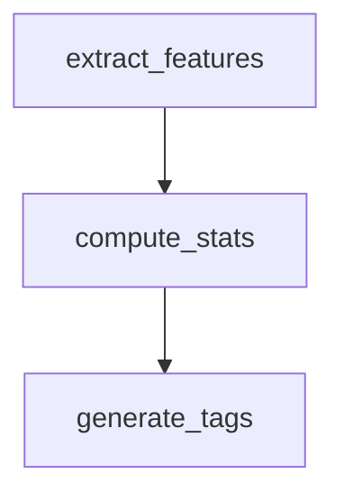

# Visualisation Guide

This guide explains how to use the TaskIQ-Flow visualization module to generate DAG representations of pipelines in JSON, DOT (Graphviz), ASCII, and Mermaid formats.

## Overview

The visualization module provides two main classes for representing pipeline DAGs:

| Class | Module | Output formats |
|-------|--------|----------------|
| `DAGVisualizer` | `taskiq_flow.visualization` | JSON, DOT, ASCII |
| `MermaidGenerator` | `taskiq_flow.visualization` | Mermaid.js flowchart |

These are **modular classes** — there is no unified renderer registry. Each format is generated by instantiating the appropriate class directly.

## DAGVisualizer

Convert a DAG to a structured dictionary (JSON-ready), DOT graph description, or ASCII art.

```python
from taskiq_flow.visualization import DAGVisualizer, visualize_pipeline

# From a DataflowPipeline instance
viz_json = pipeline.visualize()              # JSON-ready dict
dot_code = pipeline.visualize_dot()           # DOT string for Graphviz
pipeline.print_dag()                          # ASCII in console
```

### Method: `DAGVisualizer.to_json(dag)`

```python
from taskiq_flow.visualization.dag_visualizer import DAGVisualizer
from taskiq_flow.dataflow.dag import DAG

graph = dag_builder.build()  # returns a DAG
visualizer = DAGVisualizer()
data = visualizer.to_json(graph)
```

**Output** — a dictionary with `nodes` and `edges`:

```json
{
  "nodes": [
    {"id": "extract_features", "label": "extract_features", "level": 0, "state": "pending"},
    {"id": "compute_stats",   "label": "compute_stats",   "level": 1, "state": "pending"}
  ],
  "edges": [
    {"source": "extract_features", "target": "compute_stats"}
  ]
}
```

### Method: `DAGVisualizer.to_dot(dag, format="png")`

```python
from taskiq_flow.visualization.dag_visualizer import DAGVisualizer

visualizer = DAGVisualizer()
dot = visualizer.to_dot(dag, format="png")

with open("pipeline.dot", "w") as f:
    f.write(dot)
```

Render with Graphviz:

```bash
dot -Tpng pipeline.dot -o pipeline.png
```

### Method: `DAGVisualizer.to_ascii(dag)`

```python
ascii_art = visualizer.to_ascii(dag)
print(ascii_art)
```

Example output:

```
DAG: audio_pipeline
  Level 0:     extract_features
  Level 1:     compute_stats → generate_tags
                          └── create_embedding
```

Or simply use `pipeline.print_dag()` on a `DataflowPipeline`:

```python
pipeline.print_dag()
```

## MermaidGenerator

Generate Mermaid.js flowcharts from a DAG for web-based visualizations.

### Method: `MermaidGenerator.to_mermaid(dag, orientation="TB")`

```python
from taskiq_flow.visualization.mermaid import MermaidGenerator

generator = MermaidGenerator(dag)
mermaid_code = generator.to_mermaid(orientation="TB")
print(mermaid_code)
```

**Output** — Mermaid.js flowchart:



Supported orientations: `"TB"` (top-to-bottom), `"BT"` (bottom-to-top), `"LR"` (left-to-right), `"RL"` (right-to-left).

### Method: `MermaidGenerator.to_mermaid_with_styling(dag, orientation="LR")`

Generates a styled diagram with colour-coded nodes based on execution state.

```python
styled = generator.to_mermaid_with_styling(orientation="LR")
```

## Integration with DataflowPipeline

The `DataflowPipeline` class provides convenience wrappers:

```python
# JSON representation (for REST API or web UI)
json_repr = pipeline.visualize()

# DOT format (for Graphviz rendering)
dot_repr = pipeline.visualize_dot()

# ASCII representation (for terminal/debug)
pipeline.print_dag()

# Check if DAG is valid
if pipeline.is_dag_valid():
    print("DAG is valid — no cycles")
```

## Using Visualizations in FastAPI

Serve DAG visualizations via a REST endpoint:

```python
from fastapi import FastAPI

app = FastAPI()

@app.get("/dag/{pipeline_id}")
async def get_dag(pipeline_id: str):
    pipeline = get_pipeline(pipeline_id)
    return pipeline.visualize()
```

Return ASCII in a text response:

```python
@app.get("/dag/{pipeline_id}/ascii")
async def get_dag_ascii(pipeline_id: str):
    pipeline = get_pipeline(pipeline_id)
    pipeline.print_dag()
    return {"ascii": "<captured output>"}
```

## Summary

| Need | API |
|------|-----|
| JSON for web UI / API | `pipeline.visualize()` or `DAGVisualizer.to_json()` |
| DOT for Graphviz | `pipeline.visualize_dot()` or `DAGVisualizer.to_dot()` |
| ASCII for terminal | `pipeline.print_dag()` or `DAGVisualizer.to_ascii()` |
| Mermaid.js flowchart | `MermaidGenerator(dag).to_mermaid()` |

> **Note**: The `taskiq_flow.renderer_registry` module and `register_renderer()` function referenced in earlier documentation do **not exist** in the codebase. DAG rendering uses the `DAGVisualizer` and `MermaidGenerator` classes directly — there is no unified renderer registry.

---

*For DAG structure details, see the [Dataflow Guide]({{ '/en/guides/dataflow/' | relative_url }}). For the full API reference, see the [API Reference]({{ '/en/api/' | relative_url }}).*
