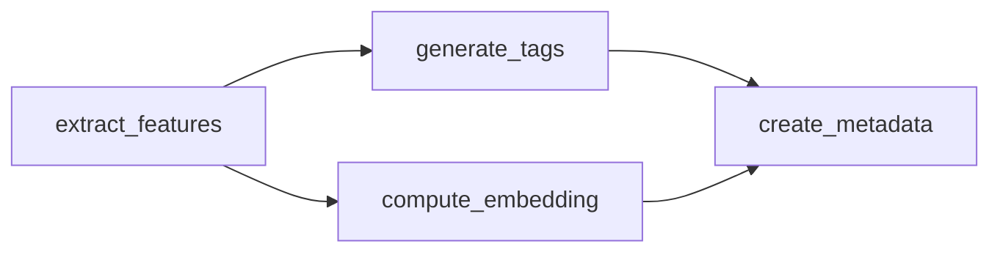

# Exemple: dag_visualization_demo.py

**Analyse DAG NetworkX : chemin critique, groupes parallèles, export**

> **Version** : 0.4.5 | **Fichier** : `examples/dag_visualization_demo.py`

---

## Aperçu

Cet exemple présente les capacités avancées de visualisation et d'analyse de DAG introduites en Taskiq-Flow v0.4.5 avec NetworkX. Il démontre :

- Construction d'un DAG depuis un DataflowPipeline
- Analyse basée NetworkX (détection chemin critique, identification groupes parallèles)
- Export vers multiples formats : JSON, Mermaid, DOT, Cytoscape
- Visualisation ASCII pour terminal
- Intégration NiceGUI pour vue interactive

---

## Ce Que Cet Exemple Montre

- Utilisation de `DAGVisualizer` pour analyse riche de DAG
- Détection du chemin critique (plus longue chaîne d'exécution)
- Identification des groupes de tâches parallèles (niveaux d'exécution)
- Génération de diagrammes Mermaid pour documentation
- Export DOT pour rendu Graphviz
- Création JSON Cytoscape pour visualisation web interactive

---

## Parcours Du Code

### 1. Définition du Pipeline

```python
from taskiq import InMemoryBroker
from taskiq_flow import DataflowPipeline, pipeline_task

broker = InMemoryBroker(await_inplace=True)

@broker.task
@pipeline_task(output="audio_features")
def extract_features(audio_path: str) -> dict:
    return {"duration": 180.0, "tempo": 120.0, "sample_rate": 44100}

@broker.task
@pipeline_task(output="tags")
def generate_tags(audio_features: dict) -> list[str]:
    return ["electronic", "dance", "upbeat"]

@broker.task
@pipeline_task(output="embedding")
def compute_embedding(audio_features: dict) -> list[float]:
    return [0.1, 0.2, 0.3, 0.4, 0.5]

@broker.task
@pipeline_task(output="metadata")
def create_metadata(audio_features: dict, tags: list[str], embedding: list[float]) -> dict:
    return {
        "features": audio_features,
        "tags": tags,
        "embedding": embedding,
    }

pipeline = DataflowPipeline.from_tasks(
    broker,
    [extract_features, generate_tags, compute_embedding, create_metadata]
)
pipeline.pipeline_id = "audio_analysis_demo"
```

Structure du DAG :
- `extract_features` s'exécute en premier (aucune dépendance)
- `generate_tags` et `compute_embedding` en parallèle (dépendent tous deux de `audio_features`)
- `create_metadata` en dernier (dépend des trois précédents)

---

### 2. Analyse NetworkX avec DAGVisualizer

```python
from taskiq_flow.visualization.dag_visualizer import DAGVisualizer

# Construire DAG (statique, sans exécution)
dag = pipeline.build_dag()
visualizer = DAGVisualizer(dag)

# 1. Export JSON basique
json_data = visualizer.to_json()
print(f"Nodes: {len(json_data['nodes'])}")
print(f"Edges: {len(json_data['edges'])}")
print(f"Is DAG: {not json_data['is_cyclic']}")
print(f"Ordre topologique: {json_data['topological_order'][:3]}...")

# 2. Détection chemin critique
critical_path = visualizer.detect_critical_path()
print(f"Chemin critique: {' -> '.join(critical_path)}")

# 3. Identification groupes parallèles
parallel_groups = visualizer.find_parallelizable_groups()
print(f"Groupes parallèles: {len(parallel_groups)} niveaux")
for i, group in enumerate(parallel_groups):
    print(f"  Niveau {i}: {group}")
```

**Chemin critique** : Plus long chemin dans le DAG, indiquant le temps d'exécution minimum avec parallélisme illimité.

**Groupes parallèles** : Tâches au même niveau peuvent s'exécuter concurremment.

---

### 3. Diagrammes Mermaid

```python
from taskiq_flow.visualization.mermaid import MermaidGenerator

mermaid_gen = MermaidGenerator(dag)
mermaid_code = mermaid_gen.to_mermaid_with_styling(orientation="LR")
print(mermaid_code)
```

Sortie Mermaid.js :



À intégrer dans docs, tableaux de bord NiceGUI, ou wikis.

---

### 4. ASCII Art (Terminal)

```python
ascii_art = visualizer.visualize_ascii()
print(ascii_art)
```

Exemple de sortie :

```
extract_features
    |
    +--> generate_tags
    |
    +--> compute_embedding
            |
            +--> create_metadata
```

Débogage visuel rapide sans outils externes.

---

### 5. Export Graphviz DOT

```python
dot = visualizer.to_graphviz()
print(dot)
```

Sauvegarder et rendre :

```bash
echo "$dot" > pipeline.dot
dot -Tpng pipeline.dot -o pipeline.png
```

Graphiques vectoriels pour présentations.

---

### 6. JSON Cytoscape pour Web

```python
cytoscape = visualizer.to_cytoscape_json()
# Contient tableaux nodes[] et edges[] prêts pour Cytoscape.js
```

Intégrez avec visualisation DAG interactive web.

---

## Sortie Attendue

Lancer `python examples/dag_visualization_demo.py` produit :

```
=== Taskiq-Flow DAG Visualization Demo ===

DAG has 4 nodes and 4 edges

1. NetworkX DAG Analysis
----------------------------------------
   Nodes: 4
   Edges: 4
   Is DAG: True
   Ordre topologique: ['extract_features', 'generate_tags', 'compute_embedding', 'create_metadata']...
   Chemin critique: extract_features -> generate_tags -> create_metadata
   Groupes parallèles: 3 niveaux
     Niveau 0: ['extract_features']
     Niveau 1: ['generate_tags', 'compute_embedding']
     Niveau 2: ['create_metadata']

2. Mermaid Diagram
----------------------------------------
flowchart LR
    extract_features --> generate_tags
    extract_features --> compute_embedding
    generate_tags --> create_metadata
    compute_embedding --> create_metadata

3. ASCII Art
----------------------------------------
extract_features
    |
    +--> generate_tags
    |
    +--> compute_embedding
            |
            +--> create_metadata

4. Graphviz DOT
----------------------------------------
digraph "audio_analysis_demo" {
  "extract_features" -> "generate_tags";
  "extract_features" -> "compute_embedding";
  "generate_tags" -> "create_metadata";
  "compute_embedding" -> "create_metadata";
}
...

5. Cytoscape JSON (for web visualization)
----------------------------------------
   Elements: 4 nodes, 4 edges

=== Demo Complete ===

All visualization formats generated successfully!
```

---

## Points Clés

### Méthodes DAGVisualizer

| Méthode | Retourne | Cas d'usage |
|---------|----------|-------------|
| `to_json()` | dict | Réponses API, UIs web |
| `detect_critical_path()` | list[str] | Identifier tâches goulots d'étranglement |
| `find_parallelizable_groups()` | list[list[str]] | Optimiser parallélisme |
| `to_graphviz()` | str | Rendu Graphviz |
| `to_cytoscape_json()` | dict | Visualisation web interactive |
| `visualize_ascii()` | str | Débogage terminal |

### Méthodes MermaidGenerator

| Méthode | Description |
|---------|-------------|
| `to_mermaid(orientation)` | Flowchart basique |
| `to_mermaid_with_styling(orientation)` | Nœuds colorés par type |
| `to_mermaid_interactive()` | Avec gestionnaires clic |

### Intégration NiceGUI

```python
from taskiq_flow.integration.nicegui import DAGViewer

viewer = DAGViewer(dag)
viewer.render_interactive()  # UI panneau divisé
# ou
viewer.render_mermaid()  # Vue basée Mermaid
```

---

## Chemin d'Apprentissage

Après cet exemple :

1. **[Guide Visualisation]({{ '/fr/guides/pipelines/#visualisation-pipeline' | relative_url }})** — Fonctionnalités complètes de visualisation DAG
2. **[Guide Performance]({{ '/fr/guides/performance/' | relative_url }})** — Utiliser l'analyse DAG pour optimisation
3. **[Intégration NiceGUI]({{ '/fr/guides/pipelines/#visualisateur-interactif-nicegui' | relative_url }})** — Construire tableaux de bord interactifs

---

*Cet exemple couvre tous les formats de sortie majeurs. Utilisez `DAGVisualizer` pour analyse programmatique et `MermaidGenerator` pour documentation.*
