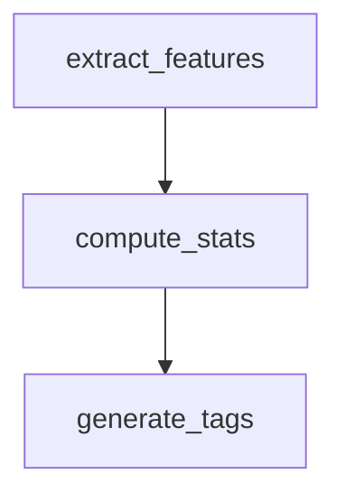

# Guide de visualisation

Ce guide explique comment utiliser le module de visualisation de TaskIQ-Flow pour générer des représentations de DAG de pipelines aux formats JSON, DOT (Graphviz), ASCII et Mermaid.

## Aperçu

Le module de visualisation fournit deux classes principales pour représenter les DAG de pipelines :

| Classe | Module | Formats de sortie |
|--------|--------|-------------------|
| `DAGVisualizer` | `taskiq_flow.visualization` | JSON, DOT, ASCII |
| `MermaidGenerator` | `taskiq_flow.visualization` | Diagramme Mermaid.js |

Ce sont des **classes modulaires** — il n'existe pas de registre de rendu unifié. Chaque format est généré en instanciant directement la classe appropriée.

## DAGVisualizer

Convertit un DAG en dictionnaire structuré (prêt pour JSON), description DOT ou art ASCII.

```python
from taskiq_flow.visualization import DAGVisualizer, visualize_pipeline

# À partir d'une instance DataflowPipeline
viz_json = pipeline.visualize()              # dict prêt pour JSON
dot_code = pipeline.visualize_dot()           # chaîne DOT pour Graphviz
pipeline.print_dag()                          # ASCII dans la console
```

### Méthode : `DAGVisualizer.to_json(dag)`

```python
from taskiq_flow.visualization.dag_visualizer import DAGVisualizer
from taskiq_flow.dataflow.dag import DAG

graphe = dag_builder.build()  # retourne un DAG
visualiseur = DAGVisualizer()
donnees = visualiseur.to_json(graphe)
```

**Sortie** — un dictionnaire avec `nodes` et `edges` :

```json
{
  "nodes": [
    {"id": "extract_features", "label": "extract_features", "level": 0, "state": "pending"},
    {"id": "compute_stats",   "label": "compute_stats",   "level": 1, "state": "pending"}
  ],
  "edges": [
    {"source": "extract_features", "target": "compute_stats"}
  ]
}
```

### Méthode : `DAGVisualizer.to_dot(dag, format="png")`

```python
from taskiq_flow.visualization.dag_visualizer import DAGVisualizer

visualiseur = DAGVisualizer()
dot = visualiseur.to_dot(graphe, format="png")

with open("pipeline.dot", "w") as f:
    f.write(dot)
```

Rendu avec Graphviz :

```bash
dot -Tpng pipeline.dot -o pipeline.png
```

### Méthode : `DAGVisualizer.to_ascii(dag)`

```python
art_ascii = visualiseur.to_ascii(graphe)
print(art_ascii)
```

Exemple de sortie :

```
DAG: audio_pipeline
  Niveau 0 :  extract_features
  Niveau 1 :  compute_stats → generate_tags
                      └── create_embedding
```

Ou utilisez simplement `pipeline.print_dag()` sur une `DataflowPipeline` :

```python
pipeline.print_dag()
```

## MermaidGenerator

Génère des organigrammes Mermaid.js à partir d'un DAG pour des visualisations web.

### Méthode : `MermaidGenerator.to_mermaid(dag, orientation="TB")`

```python
from taskiq_flow.visualization.mermaid import MermaidGenerator

generateur = MermaidGenerator(dag)
code_mermaid = generateur.to_mermaid(orientation="TB")
print(code_mermaid)
```

**Sortie** — organigramme Mermaid.js :



Orientations supportées : `"TB"` (haut-vers-bas), `"BT"` (bas-vers-haut), `"LR"` (gauche-à-droite), `"RL"` (droite-à-gauche).

### Méthode : `MermaidGenerator.to_mermaid_with_styling(dag, orientation="LR")`

Génère un diagramme stylisé avec nœuds colorés selon l'état d'exécution.

```python
style = generateur.to_mermaid_with_styling(orientation="LR")
```

## Intégration avec DataflowPipeline

La classe `DataflowPipeline` fournit des raccourcis pratiques :

```python
# Représentation JSON (pour API REST ou interface web)
json_repr = pipeline.visualize()

# Format DOT (pour rendu Graphviz)
dot_repr = pipeline.visualize_dot()

# Représentation ASCII (pour terminal/débogage)
pipeline.print_dag()

# Vérifier si le DAG est valide
if pipeline.is_dag_valid():
    print("DAG valide — pas de cycles")
```

## Utilisation dans FastAPI

Servir des visualisations de DAG via un endpoint REST :

```python
from fastapi import FastAPI

app = FastAPI()

@app.get("/dag/{pipeline_id}")
async def get_dag(pipeline_id: str):
    pipeline = get_pipeline(pipeline_id)
    return pipeline.visualize()
```

Retourner l'ASCII dans une réponse texte :

```python
@app.get("/dag/{pipeline_id}/ascii")
async def get_dag_ascii(pipeline_id: str):
    pipeline = get_pipeline(pipeline_id)
    pipeline.print_dag()
    return {"ascii": "<output capturé>"}
```

## Résumé

| Besoin | API |
|--------|-----|
| JSON pour UI web / API | `pipeline.visualize()` ou `DAGVisualizer.to_json()` |
| DOT pour Graphviz | `pipeline.visualize_dot()` ou `DAGVisualizer.to_dot()` |
| ASCII pour terminal | `pipeline.print_dag()` ou `DAGVisualizer.to_ascii()` |
| Organigramme Mermaid.js | `MermaidGenerator(dag).to_mermaid()` |

> **Note** : Le module `taskiq_flow.renderer_registry` et la fonction `register_renderer()` mentionnés dans la documentation précédente **n'existent pas** dans la base de code. Le rendu de DAG utilise les classes `DAGVisualizer` et `MermaidGenerator` directement — il n'y a pas de registre de rendu unifié.

---

*Pour les détails sur la structure du DAG, voir le [Guide Dataflow]({{ '/fr/guides/dataflow/' | relative_url }}). Pour la référence API complète, voir la [Référence API]({{ '/fr/api/' | relative_url }}).*
